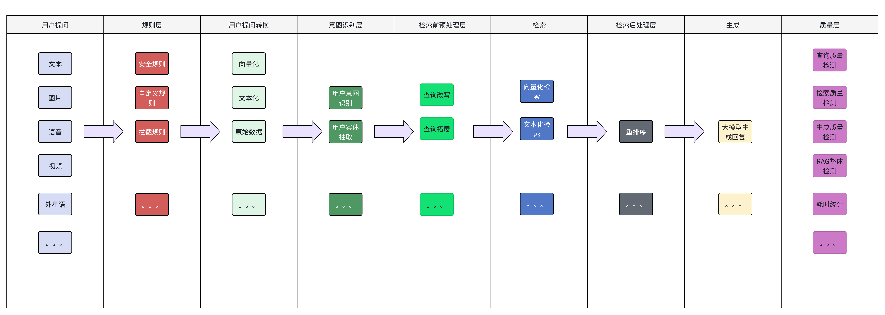

# 一个基础的RAG都需要什么？

## 数据导入&转换&切分&导入


## 用户提问&检索&生成


## haystack框架能做的？


# 一个🌰

## 技术选型

| 组件     |                   | 备注        |
| ------ | ----------------- | --------- |
| 向量数据库  | weavita           |           |
| 向量模型   | text-embedding-v4 | 维度：2048   |
| 向量索引类型 | hnsw              |           |
| 向量存储类型 | Float Vector      | 浮点型向量     |
| 大语言模型  | qwen-plus         | 用来生成最后的回复 |

## 基础环境

```python
os.environ["OPENAI_API_KEY"] = "" #使用时传入
OPENAI_API_BASE = "https://dashscope.aliyuncs.com/compatible-mode/v1"
weavita_api_key = "admin123456"
weavita_api_path = "http://0.0.0.0:8080"
DIMENSION     = 2048                   # 向量维度
```

## 先用脚本生成一些问答数据

```python
#!/usr/bin/env python3
# -*- coding: utf-8 -*-
"""
生成 10 000 条家政客服场景 QA，保存为 housekeeping_qa.csv
"""
import csv
import random
from datetime import datetime, timedelta

random.seed(42)

# ------------------ 可扩展的语料库 ------------------
SERVICES = {
    "日常保洁": {"unit": "元/小时", "price": (40, 60)},
    "深度保洁": {"unit": "元/平米", "price": (6, 12)},
    "月嫂": {"unit": "元/月", "price": (8000, 18000)},
    "育儿嫂": {"unit": "元/月", "price": (6000, 12000)},
    "钟点工": {"unit": "元/小时", "price": (35, 50)},
    "搬家": {"unit": "元/车", "price": (300, 800)},
    "家电清洗": {"unit": "元/台", "price": (80, 300)},
}

INTENTS = ["询价", "预约", "改约", "取消", "询问服务内容", "投诉"]

TIME_SLOTS = ["明天上午", "明天下午", "后天上午", "后天下午", "本周末", "下周一"]

ADDRESSES = ["朝阳区", "海淀区", "丰台区", "西城区", "东城区", "通州区", "昌平区"]

AREAS = [60, 80, 90, 100, 120, 150, 200]

DURATIONS = [2, 3, 4, 5, 8]

# ------------------ 模板 ------------------
QUESTION_TEMPLATES = {
    "询价": [
        "你们{service}怎么收费？",
        "请问{service}多少钱？",
        "{service}是什么价格？",
    ],
    "预约": [
        "我想预约{service}，{time}可以吗？",
        "帮我定一个{service}，{time}上门。",
        "{time}需要{service}，能安排吗？",
    ],
    "改约": [
        "我想把{service}改到{time}，可以吗？",
        "原定的{service}能改到{time}吗？",
    ],
    "取消": [
        "我要取消{service}订单。",
        "明天的{service}不做了，帮我取消。",
    ],
    "询问服务内容": [
        "{service}都包含什么？",
        "请问{service}的服务范围？",
    ],
    "投诉": [
        "上次的{service}做得不干净，怎么解决？",
        "{service}人员态度不好，我要投诉。",
    ],
}

ANSWER_TEMPLATES = {
    "询价": [
        "您好，{service}收费是{price}{unit}，根据需求会有浮动，具体报价以师傅上门评估为准。",
        "亲亲，{service}参考价{price}{unit}，下单后客服会与您确认最终价格。",
    ],
    "预约": [
        "好的，已为您登记{service}，{time}上门，客服会提前1小时电话确认。",
        "收到，{time}的{service}已预约成功，订单号稍后发送。",
    ],
    "改约": [
        "可以改期，已帮您把{service}调整到{time}，请注意查收短信。",
        "没问题，{service}已改到{time}，师傅会准时上门。",
    ],
    "取消": [
        "已帮您取消{service}订单，退款1-3个工作日原路返回。",
        "好的，{service}订单已取消，欢迎下次再约。",
    ],
    "询问服务内容": [
        "{service}包含：{detail}，如需深度服务可备注。",
        "亲亲，{service}范围：{detail}，有特殊需求请提前说明。",
    ],
    "投诉": [
        "非常抱歉给您带来不便，我们立即安排售后专员回访，2小时内联系您。",
        "理解您的感受，已记录投诉，24小时内给出处理方案。",
    ],
}

SERVICE_DETAIL = {
    "日常保洁": "地面、桌面、厨卫表面清洁、垃圾清理",
    "深度保洁": "全屋除垢、高温蒸汽、油烟机拆洗",
    "月嫂": "母婴护理、月子餐、新生儿喂养",
    "育儿嫂": "婴幼儿日常护理、辅食制作、早教游戏",
    "钟点工": "灵活小时工、做饭、收纳、简单保洁",
    "搬家": "家具拆装、打包、运输、复位",
    "家电清洗": "空调、油烟机、洗衣机拆洗消毒",
}

# ------------------ 生成函数 ------------------
def generate_one_qa():
    service = random.choice(list(SERVICES.keys()))
    intent = random.choice(INTENTS)
    q_tpl = random.choice(QUESTION_TEMPLATES[intent])
    a_tpl = random.choice(ANSWER_TEMPLATES[intent])

    # 槽位填充
    time = random.choice(TIME_SLOTS) if intent in ["预约", "改约"] else ""
    area = random.choice(AREAS) if service in ["深度保洁"] else ""
    duration = random.choice(DURATIONS) if service in ["日常保洁", "钟点工"] else ""

    # 价格区间
    low, high = SERVICES[service]["price"]
    price = random.randint(low, high)

    # 构造问题
    question = q_tpl.format(service=service, time=time)
    if area:
        question += f"，{area}平米"
    if duration:
        question += f"，{duration}小时"

    # 构造回答
    detail = SERVICE_DETAIL.get(service, "")
    answer = a_tpl.format(service=service, time=time, price=price,
                          unit=SERVICES[service]["unit"], detail=detail)
    return question, answer


# ------------------ 主入口 ------------------
def main(n=10_000):
    print(f"开始生成 {n} 条家政 QA …")
    with open("housekeeping_qa.csv", "w", newline='', encoding='utf-8-sig') as f:
        writer = csv.writer(f)
        writer.writerow(["question", "answer"])
        for i in range(n):
            q, a = generate_one_qa()
            writer.writerow([q, a])
            if (i + 1) % 2000 == 0:
                print(f"  已完成 {i + 1}")
    print("✅ 已保存为 housekeeping_qa.csv")


if __name__ == "__main__":
    main(500)
```

## 数据导入


```python
import logging, sys
import os
import time

from dotenv import load_dotenv, find_dotenv
from haystack import Pipeline, Document
from haystack.components.embedders import OpenAITextEmbedder, OpenAIDocumentEmbedder
from haystack.components.generators import OpenAIGenerator
from haystack_integrations.components.retrievers.weaviate import WeaviateEmbeddingRetriever
from haystack_integrations.document_stores.weaviate import WeaviateDocumentStore
from haystack.components.builders import PromptBuilder
import pandas as pd

DIMENSION     = 2048                   # 向量维度

# 1. 连接 Weaviate
document_store = WeaviateDocumentStore(
    url=weavita_api_path,
    additional_headers={"Authorization": f"Bearer {weavita_api_key}"} if weavita_api_key else {},
    collection_settings={
        "class": "DemoIndex_gt1",
        "vectorizer": "none"
    }
)
embedder_raw  = OpenAITextEmbedder(model="text-embedding-v4", api_base_url=OPENAI_API_BASE, dimensions=DIMENSION)
embedder_doc  = OpenAIDocumentEmbedder(model="text-embedding-v4", api_base_url=OPENAI_API_BASE, dimensions=DIMENSION)
retriever_raw = WeaviateEmbeddingRetriever(document_store=document_store, top_k=3)
generator_raw = OpenAIGenerator(model="qwen-plus", api_base_url=OPENAI_API_BASE,
                                generation_kwargs={"temperature": 0.1})

# 2. 写入测试文档（带日志）
df = pd.read_csv("housekeeping_qa.csv")        # question,answer 两列
docs = []
for q, a in zip(df["question"], df["answer"]):
    # 把问+答拼成一段，同时把完整答案存 meta
    docs.append(Document(content=f"{q} {a}", meta={"question": q, "answer": a}))

# 3. 逐批限速调用（一批 1 个 Document，也可以调大）
for doc in docs:
    time.sleep(1)
    out = embedder_doc.run(documents=[doc])
    document_store.write_documents(out["documents"], policy="OVERWRITE")
```

## 开始问答吧！

### 使用haystack的流水线的例子

```python
import logging, sys
import os
import time

from haystack import Pipeline, Document
from haystack.components.embedders import OpenAITextEmbedder, OpenAIDocumentEmbedder
from haystack.components.generators import OpenAIGenerator
from haystack_integrations.components.retrievers.weaviate import WeaviateEmbeddingRetriever
from haystack_integrations.document_stores.weaviate import WeaviateDocumentStore
from haystack.components.builders import PromptBuilder


# 1. 连接 Weaviate
document_store = WeaviateDocumentStore(
    url=weavita_api_path,
    additional_headers={"Authorization": f"Bearer {weavita_api_key}"} if weavita_api_key else {},
    collection_settings={
        "class": "DemoIndex_gt1",
        "vectorizer": "none"
    }
)
embedder_raw  = OpenAITextEmbedder(model="text-embedding-v4", api_base_url=OPENAI_API_BASE, dimensions=DIMENSION)
embedder_doc  = OpenAIDocumentEmbedder(model="text-embedding-v4", api_base_url=OPENAI_API_BASE, dimensions=DIMENSION)
retriever_raw = WeaviateEmbeddingRetriever(document_store=document_store, top_k=3)
generator_raw = OpenAIGenerator(model="qwen-plus", api_base_url=OPENAI_API_BASE,
                                generation_kwargs={"temperature": 0.1})

# 4. 模板与 prompt_builder（无需壳）
template = """

{{ doc.content }}


根据以上内容，回答：{{query}}
"""
prompt_builder = PromptBuilder(template=template, required_variables=["query"])

# 5. 组装管道
pipe = Pipeline()
pipe.add_component("embedder", embedder_raw)
pipe.add_component("retriever", retriever_raw)
pipe.add_component("prompt_builder", prompt_builder)
pipe.add_component("generator", generator_raw)

pipe.connect("embedder.embedding", "retriever.query_embedding")
pipe.connect("retriever.documents", "prompt_builder.documents")
pipe.connect("prompt_builder.prompt", "generator.prompt")

# 6. 运行一次问答
question = "我要投诉"
result = pipe.run(data={
    "embedder": {"text": question},
    "prompt_builder": {"query": question}
})

print("=== 最终回答 ===")
print(result["generator"]["replies"][0])

document_store.client.close()
```


### 只是使用haystack的组件，但是自己拼装执行各个组件，这样更清晰

```python
# 1. 连接 Weaviate
document_store = WeaviateDocumentStore(
    url=weavita_api_path,
    additional_headers={"Authorization": f"Bearer {weavita_api_key}"} if weavita_api_key else {},
    collection_settings={
        "class": "DemoIndex_gt1",
        "vectorizer": "none"
    }
)
embedder_raw  = OpenAITextEmbedder(model="text-embedding-v4", api_base_url=OPENAI_API_BASE, dimensions=DIMENSION)
embedder_doc  = OpenAIDocumentEmbedder(model="text-embedding-v4", api_base_url=OPENAI_API_BASE, dimensions=DIMENSION)
retriever_raw = WeaviateEmbeddingRetriever(document_store=document_store, top_k=3)
generator_raw = OpenAIGenerator(model="qwen-plus", api_base_url=OPENAI_API_BASE,
                                generation_kwargs={"temperature": 0.1})

# 6. 运行一次问答 + 把各环节都打印出来
question = "我要投诉"

print("=== 用户问题 ===")
print(question)

# 6.1 先手动拿 query embedding（方便打印）
from haystack import Document
query_emb = embedder_raw.run(text=question)
print("\n=== Query 向量（前 10 维）===")
print(query_emb["embedding"][:10])

# 6.2 用向量去 Weaviate 做检索
retrieved = retriever_raw.run(query_embedding=query_emb["embedding"])
print("\n=== 检索到的文档（top-k=3）===")
for idx, doc in enumerate(retrieved["documents"], 1):
    print(f"[{idx}] content : {doc.content[:120]}…")
    print(f"    score  : {doc.score}")
    print(f"    meta   : {doc.meta}\n")

# 6.3 把文档塞进提示词模板
prompt_text = prompt_builder.run(documents=retrieved["documents"], query=question)["prompt"]
print("=== 最终提示词（Prompt）===")
print(prompt_text)

# 6.4 调用生成模型
gen_result = generator_raw.run(prompt=prompt_text)
print("=== 生成参数 ===")
print("model       :", generator_raw.model)
print("temperature :", generator_raw.generation_kwargs.get("temperature"))
print("\n=== 模型回答 ===")
print(gen_result["replies"][0])

# 6.5 收尾
document_store.client.close()
```

